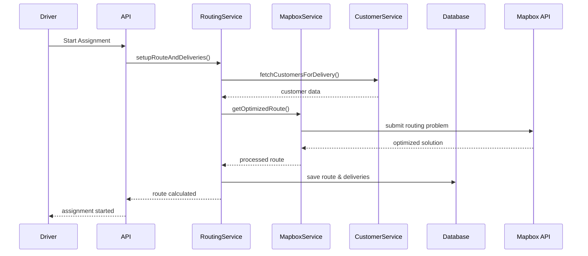

# Mapbox Integration for Route Optimization

This document explains the integration of Mapbox's Optimization API v2 for efficient route planning and delivery management in the driver server.

## Overview

The system now includes:
- **Route Optimization**: Uses Mapbox Optimization API v2 to calculate optimal delivery routes
- **Delivery Management**: Track individual deliveries with status updates and proof of delivery
- **Customer Integration**: Fetch customer data from external services for route planning
- **Navigation Support**: Provides turn-by-turn navigation data for drivers

## 🚀 Quick Start

### 1. Environment Setup

Add your Mapbox access token to your environment variables:

```bash
MAPBOX_ACCESS_TOKEN=your_mapbox_access_token_here
```

### 2. Database Migration

The new models have been added to the database schema:

```bash
npx prisma migrate dev
npx prisma generate
```

### 3. System Integration

When drivers start an assignment, the system automatically:
1. Fetches customer data for deliveries
2. Calls Mapbox Optimization API to calculate optimal route
3. Creates delivery records with optimized sequence
4. Marks deliveries as "picked up"

## 📊 Database Schema

### New Models

#### DeliveryRoute
Stores optimized route information for each assignment:
- `routePolyline`: Route path data (optional)
- `totalDistanceKm`: Total distance of the route
- `estimatedDurationMinutes`: Estimated completion time
- `optimizedStopSequence`: JSON array of optimized delivery sequence
- `routeMetadata`: Full Mapbox solution data

#### Delivery
Individual delivery records:
- `clientId`: Customer identifier
- `deliveryAddress`: JSON object with customer address details
- `deliveryLatitude/Longitude`: Precise delivery coordinates
- `sequenceNumber`: Order in optimized route
- `status`: PENDING → PICKED_UP → IN_TRANSIT → DELIVERED/FAILED
- `proofImageUrl`: Photo proof of delivery
- `deliveryNotes`: Driver notes and delivery details

#### DeliveryStatus Enum
```typescript
enum DeliveryStatus {
  PENDING     // Delivery is pending
  PICKED_UP   // Food has been picked up from restaurant
  IN_TRANSIT  // Driver is en route to customer
  DELIVERED   // Successfully delivered
  FAILED      // Delivery failed/couldn't complete
  CANCELLED   // Delivery was cancelled
}
```

## 🛣️ Route Management API

### Get Optimized Route
```http
GET /api/assignments/{id}/route
Authorization: Bearer {token}
```

**Response:**
```json
{
  "success": true,
  "data": {
    "id": "route-uuid",
    "totalDistanceKm": 15.25,
    "estimatedDurationMinutes": 45,
    "optimizedStopSequence": [...],
    "deliveries": [
      {
        "id": "delivery-uuid",
        "clientId": "customer-001",
        "sequenceNumber": 1,
        "status": "PICKED_UP",
        "address": { ... },
        "latitude": 37.7749,
        "longitude": -122.4194
      }
    ]
  }
}
```

### Recalculate Route
```http
PUT /api/assignments/{id}/route/recalculate
Authorization: Bearer {token}
```

Recalculates the route using current assignment data and customer information.

### Get Navigation Data
```http
GET /api/assignments/{id}/navigation
Authorization: Bearer {token}
```

**Response:**
```json
{
  "success": true,
  "data": {
    "currentStep": 2,
    "totalSteps": 5,
    "nextDelivery": {
      "id": "delivery-uuid",
      "clientId": "customer-002",
      "address": { ... },
      "sequenceNumber": 2
    },
    "remainingDeliveries": [...],
    "estimatedTimeToNext": 8,
    "estimatedTotalTime": 25
  }
}
```

## 📦 Delivery Management API

### List Assignment Deliveries
```http
GET /api/assignments/{id}/deliveries
Authorization: Bearer {token}
```

### Get Delivery Details
```http
GET /api/deliveries/{id}
Authorization: Bearer {token}
```

### Update Delivery Status

#### Start Delivery (Mark as In Transit)
```http
PUT /api/deliveries/{id}/start
Authorization: Bearer {token}
```

#### Complete Delivery
```http
PUT /api/deliveries/{id}/complete
Authorization: Bearer {token}
Content-Type: application/json

{
  "proofImageUrl": "https://cloudinary.com/image.jpg",
  "deliveryNotes": "Delivered to front door",
  "deliveredAt": "2023-07-03T14:30:00Z"
}
```

#### Mark Delivery as Failed
```http
PUT /api/deliveries/{id}/fail
Authorization: Bearer {token}
Content-Type: application/json

{
  "reason": "Customer not available",
  "notes": "Called multiple times, no answer"
}
```

#### Upload Proof of Delivery
```http
POST /api/deliveries/{id}/proof
Authorization: Bearer {token}
Content-Type: application/json

{
  "proofImageUrl": "https://cloudinary.com/proof.jpg"
}
```

#### Add Delivery Notes
```http
POST /api/deliveries/{id}/notes
Authorization: Bearer {token}
Content-Type: application/json

{
  "notes": "Customer requested contactless delivery"
}
```

### Search Deliveries
```http
GET /api/deliveries/search?status=DELIVERED&clientId=customer-001&page=1&limit=10
Authorization: Bearer {token}
```

## 🏗️ Architecture

### Services Overview

#### MapboxService (`src/apps/routing/mapbox.service.ts`)
- Handles Mapbox Optimization API v2 integration
- Submits routing problems and polls for solutions
- Processes optimization results into application format

#### RoutingService (`src/apps/routing/routing.service.ts`)
- Orchestrates route calculation workflow
- Integrates customer data with Mapbox optimization
- Manages database operations for routes and deliveries

#### CustomersService (`src/apps/customers/customers.service.ts`)
- **Placeholder service** for fetching customer data
- Currently returns mock data - **replace with actual API calls**
- Validates customer locations and addresses

#### DeliveriesService (`src/apps/deliveries/deliveries.service.ts`)
- Manages individual delivery operations
- Handles status updates, notes, and proof of delivery
- Provides delivery statistics and search functionality

### Integration Flow



## 🔧 Configuration

### Mapbox Configuration (`src/config/mapbox.ts`)
```typescript
export const mapboxConfig = {
  apiKey: process.env.MAPBOX_ACCESS_TOKEN,
  baseUrl: 'https://api.mapbox.com',
  optimizationUrl: 'https://api.mapbox.com/optimized-trips/v2',
  maxPollingAttempts: 30,
  pollingIntervalMs: 2000,
};
```

### Customer Service Integration

**IMPORTANT**: The `CustomersService` currently uses mock data. Update the following:

1. **Replace mock implementation** in `fetchCustomersForDelivery()`:
```typescript
// TODO: Replace with actual API call
const response = await fetch(`${CUSTOMER_API_URL}/restaurants/${restaurantId}/orders?date=${assignmentDate}`);
const customers = await response.json();
```

2. **Configure customer API endpoint**:
```bash
CUSTOMER_API_URL=https://your-customer-api.com/api
```

3. **Update restaurant location data** in `RoutingService.setupRouteAndDeliveries()`:
```typescript
// TODO: Fetch from restaurant service
const restaurantLocation = await restaurantService.getLocation(restaurantId);
```

## 📈 Monitoring and Analytics

### Delivery Statistics
```http
GET /api/assignments/{id}/deliveries/stats
```

**Response:**
```json
{
  "success": true,
  "data": {
    "total": 8,
    "pending": 0,
    "pickedUp": 0,
    "inTransit": 1,
    "delivered": 6,
    "failed": 1,
    "cancelled": 0,
    "completionRate": 75.0,
    "remainingDeliveries": 1
  }
}
```

## 🚨 Error Handling

### Route Calculation Failures
- System continues assignment start even if route calculation fails
- Deliveries can be created manually or routes recalculated later
- Logs warnings for debugging

### Mapbox API Limits
- Rate limiting: 300 routing problems per minute
- Timeout handling: 30 polling attempts with 2-second intervals
- Graceful degradation when API is unavailable

### Customer Data Issues
- Validates customer locations before route calculation
- Handles missing or invalid customer data gracefully
- Provides meaningful error messages for debugging

## 🔮 Future Enhancements

1. **Real-time Updates**: WebSocket integration for live delivery tracking
2. **Route Polylines**: Integrate with Mapbox Directions API for visual routes
3. **ETA Updates**: Real-time estimated arrival time updates
4. **Geofencing**: Automatic status updates based on driver location
5. **Route Replay**: Historical route analysis and optimization insights
6. **Multi-vehicle Optimization**: Support for multiple drivers per restaurant

## 🛠️ Troubleshooting

### Common Issues

#### Mapbox API Key Issues
```bash
Error: MAPBOX_ACCESS_TOKEN environment variable is required
```
**Solution**: Set the environment variable with your Mapbox access token.

#### Route Calculation Timeout
```bash
Error: Optimization timeout - solution took too long to compute
```
**Solution**: 
- Check customer data quality (valid coordinates)
- Reduce number of deliveries per assignment
- Verify Mapbox API status

#### Customer Data Not Found
```bash
Error: No customers found for delivery
```
**Solution**: 
- Verify customer service integration
- Check restaurant ID and assignment date
- Review customer service mock data

For additional support, check the application logs and Mapbox API documentation at [docs.mapbox.com](https://docs.mapbox.com/api/navigation/optimization/). 