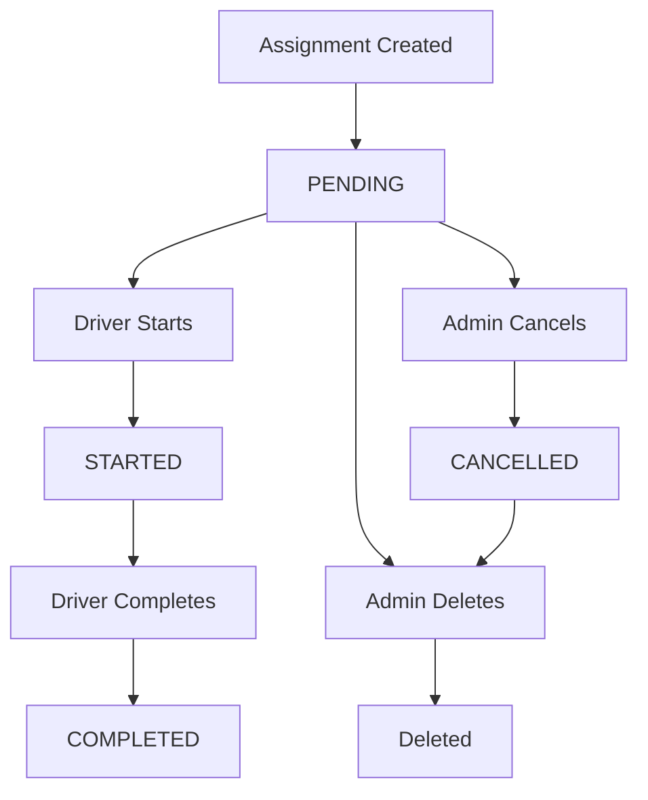

# Restaurant Assignment API

This section covers restaurant assignment operations including assignment management, driver workflow, and external assignment creation.

**Base URL**: `/api/assignments`

---

## 📋 Assignment Overview

The restaurant assignment system allows:
- **Drivers** to view, start, and complete their assignments
- **External systems/algorithms** to create and manage assignments
- **Restaurant bulk delivery management** with status tracking

### Assignment Status Flow
```
PENDING → STARTED → COMPLETED
    ↓
CANCELLED (optional)
```

### Business Rules
- One driver per restaurant per day (but restaurants can have multiple drivers)
- Drivers cannot reject assignments (mandatory acceptance)
- Only ACTIVE drivers can receive assignments  
- Assignments cannot be created for past dates
- Started assignments cannot be deleted

---

## 🚗 Driver Assignment Operations

### 34. Get Driver's Assignments

**GET** `/api/assignments`

Get all assignments for the authenticated driver with optional filtering and pagination.

#### Request
- **Headers**: `Authorization: Bearer <token>`
- **Query Parameters** (all optional):
  - `status`: Assignment status (`PENDING`, `STARTED`, `COMPLETED`, `CANCELLED`)
  - `restaurantId`: Filter by specific restaurant
  - `startDate`: Filter from date (YYYY-MM-DD)
  - `endDate`: Filter to date (YYYY-MM-DD)
  - `page`: Page number (default: 1)
  - `limit`: Items per page (default: 10)

#### Success Response (200)
```json
{
  "assignments": [
    {
      "id": "assignment-uuid",
      "driverId": 123,
      "restaurantId": "restaurant-123",
      "assignmentDate": "2024-01-15T00:00:00.000Z",
      "pickupTime": "11:00",
      "estimatedDeliveries": 25,
      "actualDeliveries": 23,
      "status": "COMPLETED",
      "paymentType": "FIXED",
      "paymentRate": 150.00,
      "notes": "Peak lunch delivery",
      "createdAt": "2024-01-10T00:00:00.000Z",
      "updatedAt": "2024-01-15T14:30:00.000Z",
      "driver": {
        "id": 123,
        "name": "John Doe",
        "email": "john.doe@example.com"
      }
    }
  ],
  "total": 1,
  "pagination": {
    "page": 1,
    "limit": 10,
    "totalPages": 1
  }
}
```

#### Error Responses
- **401 Unauthorized**
  ```json
  {
    "error": "Unauthorized"
  }
  ```

- **500 Internal Server Error**
  ```json
  {
    "error": "Failed to fetch assignments"
  }
  ```

---

### 35. Get Pending Assignments

**GET** `/api/assignments/pending`

Get all pending assignments for the authenticated driver.

#### Request
- **Headers**: `Authorization: Bearer <token>`

#### Success Response (200)
```json
{
  "assignments": [
    {
      "id": "assignment-uuid",
      "driverId": 123,
      "restaurantId": "restaurant-456",
      "assignmentDate": "2024-01-16T00:00:00.000Z",
      "pickupTime": "10:30",
      "estimatedDeliveries": 30,
      "actualDeliveries": null,
      "status": "PENDING",
      "paymentType": "PER_DELIVERY",
      "paymentRate": 8.50,
      "notes": null,
      "createdAt": "2024-01-10T00:00:00.000Z",
      "updatedAt": "2024-01-10T00:00:00.000Z",
      "driver": {
        "id": 123,
        "name": "John Doe",
        "email": "john.doe@example.com"
      }
    }
  ]
}
```

---

### 36. Get Today's Assignments

**GET** `/api/assignments/today`

Get all assignments for the authenticated driver scheduled for today.

#### Request
- **Headers**: `Authorization: Bearer <token>`

#### Success Response (200)
```json
{
  "assignments": [
    {
      "id": "assignment-uuid",
      "driverId": 123,
      "restaurantId": "restaurant-789",
      "assignmentDate": "2024-01-15T00:00:00.000Z",
      "pickupTime": "11:00",
      "estimatedDeliveries": 20,
      "actualDeliveries": null,
      "status": "STARTED",
      "paymentType": "HOURLY",
      "paymentRate": 18.00,
      "notes": "Started pickup at restaurant",
      "createdAt": "2024-01-10T00:00:00.000Z",
      "updatedAt": "2024-01-15T11:05:00.000Z",
      "driver": {
        "id": 123,
        "name": "John Doe",
        "email": "john.doe@example.com"
      }
    }
  ]
}
```

---

### 37. Get Assignment Summary

**GET** `/api/assignments/summary`

Get dashboard summary statistics for the authenticated driver.

#### Request
- **Headers**: `Authorization: Bearer <token>`

#### Success Response (200)
```json
{
  "totalAssignments": 45,
  "pendingAssignments": 3,
  "completedAssignments": 40,
  "todayAssignments": 2,
  "upcomingAssignments": 5
}
```

---

### 38. Get Assignment Details

**GET** `/api/assignments/:id`

Get detailed information about a specific assignment.

#### Request
- **Headers**: `Authorization: Bearer <token>`
- **Parameters**: `id` (assignment UUID)

#### Success Response (200)
```json
{
  "id": "assignment-uuid",
  "driverId": 123,
  "restaurantId": "restaurant-123",
  "assignmentDate": "2024-01-15T00:00:00.000Z",
  "pickupTime": "11:00",
  "estimatedDeliveries": 25,
  "actualDeliveries": 23,
  "status": "COMPLETED",
  "paymentType": "FIXED",
  "paymentRate": 150.00,
  "notes": "Completed all deliveries successfully",
  "createdAt": "2024-01-10T00:00:00.000Z",
  "updatedAt": "2024-01-15T14:30:00.000Z",
  "driver": {
    "id": 123,
    "name": "John Doe",
    "email": "john.doe@example.com"
  }
}
```

#### Error Responses
- **404 Not Found**
  ```json
  {
    "error": "Assignment not found"
  }
  ```

---

### 39. Start Assignment

**PUT** `/api/assignments/:id/start`

Mark an assignment as started. Only PENDING assignments can be started.

#### Request
- **Headers**: `Authorization: Bearer <token>`, `Content-Type: application/json`
- **Parameters**: `id` (assignment UUID)
- **Body** (optional):
```json
{
  "notes": "Starting pickup at restaurant"
}
```

#### Success Response (200)
```json
{
  "id": "assignment-uuid",
  "driverId": 123,
  "restaurantId": "restaurant-123",
  "assignmentDate": "2024-01-15T00:00:00.000Z",
  "pickupTime": "11:00",
  "estimatedDeliveries": 25,
  "actualDeliveries": null,
  "status": "STARTED",
  "paymentType": "FIXED",
  "paymentRate": 150.00,
  "notes": "Starting pickup at restaurant",
  "createdAt": "2024-01-10T00:00:00.000Z",
  "updatedAt": "2024-01-15T11:05:00.000Z",
  "driver": {
    "id": 123,
    "name": "John Doe",
    "email": "john.doe@example.com"
  }
}
```

#### Error Responses
- **400 Bad Request** (Invalid status)
  ```json
  {
    "error": "Assignment can only be started if it is pending"
  }
  ```

- **404 Not Found**
  ```json
  {
    "error": "Assignment not found"
  }
  ```

---

### 40. Complete Assignment

**PUT** `/api/assignments/:id/complete`

Mark an assignment as completed. Only STARTED assignments can be completed.

#### Request
- **Headers**: `Authorization: Bearer <token>`, `Content-Type: application/json`
- **Parameters**: `id` (assignment UUID)
- **Body**:
```json
{
  "actualDeliveries": 23,                    // Required: number >= 0
  "notes": "Completed all deliveries successfully"  // Optional: string
}
```

#### Success Response (200)
```json
{
  "id": "assignment-uuid",
  "driverId": 123,
  "restaurantId": "restaurant-123",
  "assignmentDate": "2024-01-15T00:00:00.000Z",
  "pickupTime": "11:00",
  "estimatedDeliveries": 25,
  "actualDeliveries": 23,
  "status": "COMPLETED",
  "paymentType": "FIXED",
  "paymentRate": 150.00,
  "notes": "Completed all deliveries successfully",
  "createdAt": "2024-01-10T00:00:00.000Z",
  "updatedAt": "2024-01-15T14:30:00.000Z",
  "driver": {
    "id": 123,
    "name": "John Doe",
    "email": "john.doe@example.com"
  }
}
```

#### Error Responses
- **400 Bad Request** (Missing actual deliveries)
  ```json
  {
    "error": "actualDeliveries is required and must be 0 or greater"
  }
  ```

- **400 Bad Request** (Invalid status)
  ```json
  {
    "error": "Assignment can only be completed if it has been started"
  }
  ```

---

## 🏢 External/Admin Assignment Operations

### 41. Create Assignment

**POST** `/api/assignments`

Create a new restaurant assignment. Used by external systems or admin interfaces.

#### Request
- **Headers**: `Content-Type: application/json`
- **Body**:
```json
{
  "driverId": 123,                          // Required: number
  "restaurantId": "restaurant-123",         // Required: string
  "assignmentDate": "2024-01-15",           // Required: YYYY-MM-DD
  "pickupTime": "11:00",                    // Required: HH:MM
  "estimatedDeliveries": 25,                // Required: number > 0
  "paymentType": "FIXED",                   // Optional: FIXED|PER_DELIVERY|HOURLY
  "paymentRate": 150.00,                    // Required: number > 0
  "notes": "Peak lunch delivery"            // Optional: string
}
```

#### Success Response (201)
```json
{
  "id": "assignment-uuid",
  "driverId": 123,
  "restaurantId": "restaurant-123",
  "assignmentDate": "2024-01-15T00:00:00.000Z",
  "pickupTime": "11:00",
  "estimatedDeliveries": 25,
  "actualDeliveries": null,
  "status": "PENDING",
  "paymentType": "FIXED",
  "paymentRate": 150.00,
  "notes": "Peak lunch delivery",
  "createdAt": "2024-01-10T00:00:00.000Z",
  "updatedAt": "2024-01-10T00:00:00.000Z",
  "driver": {
    "id": 123,
    "name": "John Doe",
    "email": "john.doe@example.com"
  }
}
```

#### Error Responses
- **400 Bad Request** (Missing fields)
  ```json
  {
    "error": "Missing required fields: driverId, restaurantId, assignmentDate, pickupTime, estimatedDeliveries, paymentRate"
  }
  ```

- **400 Bad Request** (Validation failed)
  ```json
  {
    "error": "Assignment validation failed: Driver not found or not active, Assignment date cannot be in the past"
  }
  ```

---

### 42. Update Assignment

**PUT** `/api/assignments/:id`

Update an existing assignment. Used by external systems or admin interfaces.

#### Request
- **Headers**: `Content-Type: application/json`
- **Parameters**: `id` (assignment UUID)
- **Body** (all fields optional):
```json
{
  "assignmentDate": "2024-01-16",
  "pickupTime": "10:30",
  "estimatedDeliveries": 30,
  "actualDeliveries": 28,
  "paymentType": "PER_DELIVERY",
  "paymentRate": 8.50,
  "notes": "Updated delivery count"
}
```

#### Success Response (200)
```json
{
  "id": "assignment-uuid",
  "driverId": 123,
  "restaurantId": "restaurant-123",
  "assignmentDate": "2024-01-16T00:00:00.000Z",
  "pickupTime": "10:30",
  "estimatedDeliveries": 30,
  "actualDeliveries": 28,
  "status": "PENDING",
  "paymentType": "PER_DELIVERY",
  "paymentRate": 8.50,
  "notes": "Updated delivery count",
  "createdAt": "2024-01-10T00:00:00.000Z",
  "updatedAt": "2024-01-11T00:00:00.000Z",
  "driver": {
    "id": 123,
    "name": "John Doe",
    "email": "john.doe@example.com"
  }
}
```

#### Error Responses
- **404 Not Found**
  ```json
  {
    "error": "Assignment not found"
  }
  ```

---

### 43. Delete Assignment

**DELETE** `/api/assignments/:id`

Delete an assignment. Only PENDING or CANCELLED assignments can be deleted.

#### Request
- **Parameters**: `id` (assignment UUID)

#### Success Response (204)
No content returned.

#### Error Responses
- **400 Bad Request** (Cannot delete)
  ```json
  {
    "error": "Cannot delete an assignment that has been started"
  }
  ```

- **404 Not Found**
  ```json
  {
    "error": "Assignment not found"
  }
  ```

---

## 📊 Data Types Reference

### Assignment Object
```typescript
interface Assignment {
  id: string;                    // UUID
  driverId: number;             // User ID
  restaurantId: string;         // External restaurant identifier
  assignmentDate: Date;         // Assignment date (date only)
  pickupTime: string;           // HH:MM format
  estimatedDeliveries: number;  // Expected delivery count
  actualDeliveries: number | null; // Actual delivery count (set on completion)
  status: AssignmentStatus;     // Current status
  paymentType: PaymentType;     // Payment method
  paymentRate: number;          // Payment amount (decimal)
  notes: string | null;         // Optional notes
  createdAt: Date;             // Creation timestamp
  updatedAt: Date;             // Last update timestamp
  driver: {                    // Driver information
    id: number;
    name: string | null;
    email: string;
  };
}
```

### Assignment Status
```typescript
enum AssignmentStatus {
  PENDING = "PENDING",       // Assignment created but not started
  STARTED = "STARTED",       // Driver has started the assignment
  COMPLETED = "COMPLETED",   // Assignment completed
  CANCELLED = "CANCELLED"    // Assignment cancelled
}
```

### Payment Type
```typescript
enum PaymentType {
  FIXED = "FIXED",           // Fixed rate payment
  PER_DELIVERY = "PER_DELIVERY", // Payment per delivery
  HOURLY = "HOURLY"          // Hourly rate
}
```

---

## 🧪 Testing Examples

### Complete Assignment Workflow

#### 1. Create Assignment (External System)
```bash
curl -X POST http://localhost:3000/api/assignments \
  -H "Content-Type: application/json" \
  -d '{
    "driverId": 123,
    "restaurantId": "restaurant-abc",
    "assignmentDate": "2024-01-15",
    "pickupTime": "11:00",
    "estimatedDeliveries": 25,
    "paymentType": "FIXED",
    "paymentRate": 150.00,
    "notes": "Peak lunch delivery"
  }'
```

#### 2. Driver Views Assignments
```bash
curl -X GET "http://localhost:3000/api/assignments?status=PENDING" \
  -H "Authorization: Bearer <driver_token>"
```

#### 3. Driver Starts Assignment
```bash
curl -X PUT http://localhost:3000/api/assignments/assignment-uuid/start \
  -H "Authorization: Bearer <driver_token>" \
  -H "Content-Type: application/json" \
  -d '{
    "notes": "Starting pickup at restaurant"
  }'
```

#### 4. Driver Completes Assignment
```bash
curl -X PUT http://localhost:3000/api/assignments/assignment-uuid/complete \
  -H "Authorization: Bearer <driver_token>" \
  -H "Content-Type: application/json" \
  -d '{
    "actualDeliveries": 23,
    "notes": "Completed all deliveries successfully"
  }'
```

### Filtering Examples

#### Get assignments for specific date range
```bash
curl -X GET "http://localhost:3000/api/assignments?startDate=2024-01-01&endDate=2024-01-31&page=1&limit=20" \
  -H "Authorization: Bearer <driver_token>"
```

#### Get assignments for specific restaurant
```bash
curl -X GET "http://localhost:3000/api/assignments?restaurantId=restaurant-123" \
  -H "Authorization: Bearer <driver_token>"
```

---

## ⚠️ Error Handling

### Common HTTP Status Codes
- **200 OK**: Request successful
- **201 Created**: Assignment created successfully  
- **204 No Content**: Assignment deleted successfully
- **400 Bad Request**: Invalid request data or business rule violation
- **401 Unauthorized**: Authentication required or failed
- **403 Forbidden**: User doesn't have permission for this action
- **404 Not Found**: Assignment not found
- **409 Conflict**: Assignment already exists (duplicate)
- **500 Internal Server Error**: Server error occurred

### Validation Rules
- Driver must exist and have ACTIVE status
- Assignment date cannot be in the past
- No duplicate assignments (same driver, restaurant, date)
- Estimated deliveries must be > 0
- Payment rate must be > 0
- Only PENDING assignments can be started
- Only STARTED assignments can be completed
- Only PENDING/CANCELLED assignments can be deleted

---

## 🔄 Assignment Lifecycle



### Status Transitions
- **PENDING → STARTED**: Driver starts assignment (`PUT /:id/start`)
- **STARTED → COMPLETED**: Driver completes assignment (`PUT /:id/complete`)
- **PENDING → CANCELLED**: Admin cancels assignment (external action)
- **PENDING/CANCELLED → DELETED**: Admin deletes assignment (`DELETE /:id`)

### Restrictions
- Cannot transition backwards (e.g., STARTED → PENDING)
- Cannot delete STARTED assignments
- Cannot start non-PENDING assignments
- Cannot complete non-STARTED assignments 